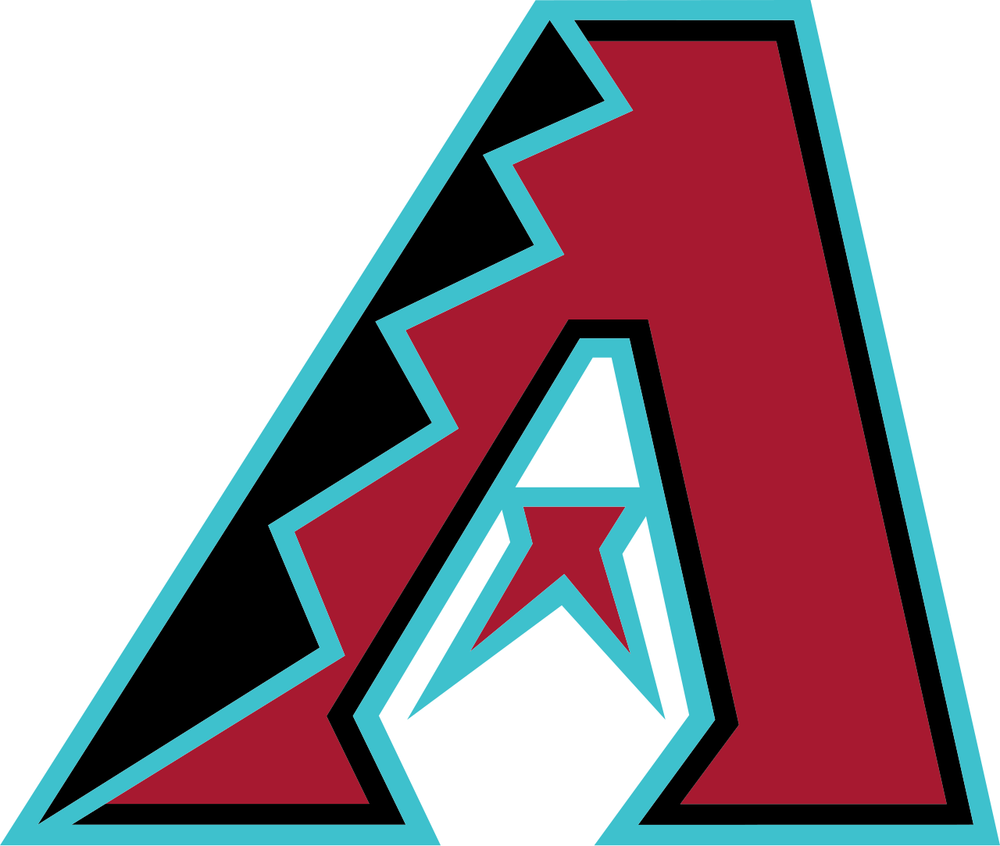
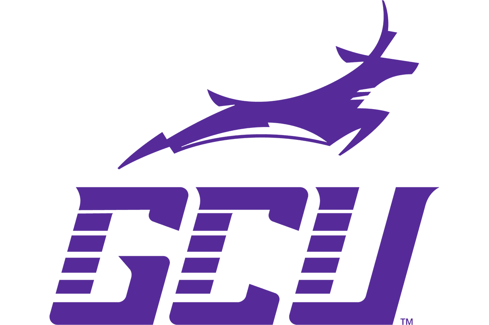

:::{.hero-panel}
## Sports business and analytics, business management, and data-driven research

I am Ben Kleiman, a UC San Diego MSBA student with experience in college baseball, analytics, MLB front office work, and business analytics.

This site is where I share my background, selected work, and the ideas I am exploring as I continue to grow in data and business analytics.

[View Resume](resume.qmd){.hero-button}
[See Projects](projects.qmd){.hero-button .hero-button-secondary}
:::

:::{.journey-panel}
### Experience Snapshot

A quick look at the organizations and programs that have shaped my path so far.

:::{.journey-grid}
:::{.journey-card}
{.journey-logo}
**Arizona Diamondbacks**

I worked in the Community Impact department with Authentics as both an intern and a supervisor, helping sell game-used and team-issued items that supported the D-backs Give Back foundation.
:::

:::{.journey-card}
{.journey-logo}
**Grand Canyon University**

I graduated with a BS in Sports and Entertainment Management and worked with the Division I baseball team as the Assistant Director of Business Analytics.
:::

:::{.journey-card}
{.journey-logo}
**UC San Diego**

I am currently in the MSBA program and serve in the Rady Data Analytics Club as the Director of Relations and Outreach.
:::
:::
:::

:::{.quick-grid}
:::{.quick-card}
### About Me

Learn more about my background, interests, and what I am currently focused on.

[Read more](about.qmd)
:::

:::{.quick-card}
### Projects

Browse coursework, technical work, and other portfolio pieces as they are added.

[Browse projects](projects.qmd)
:::

:::{.quick-card}
### Resume

Open a full PDF version of my resume and experience summary.

[Open resume](resume.qmd)
:::
:::
